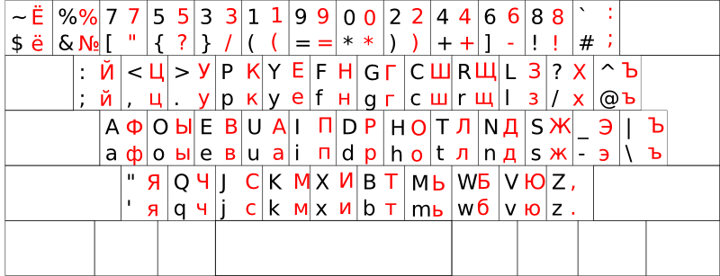

Русская раскладки, совместимая с Programmer Dvorak
===========================================================================

Для английского языка все это точная копия [Programmer
Dvorak](http://www.kaufmann.no/roland/dvorak/).  Для русского языка
доступны все символы обычной windows-раскладки, но в максимально
совместимом с Programmer Dvorak виде.

Установка
=========

Emacs
-----

xorg
----
